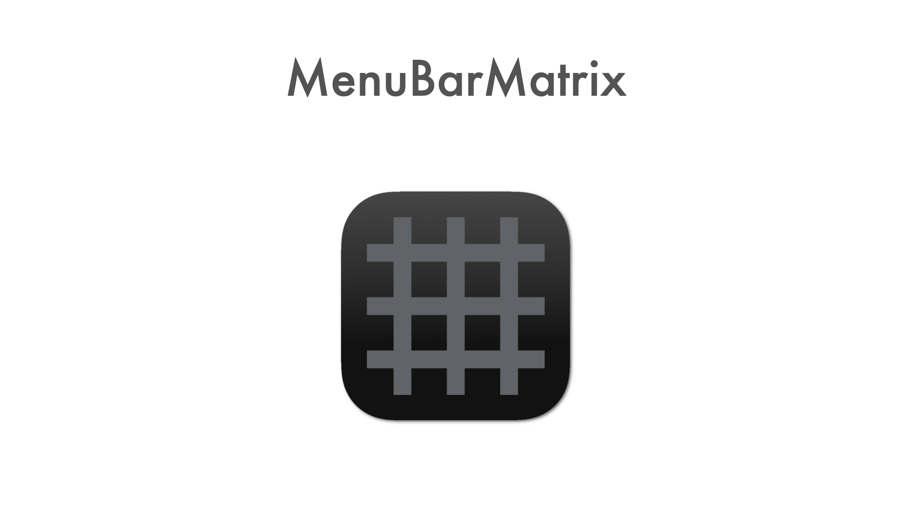
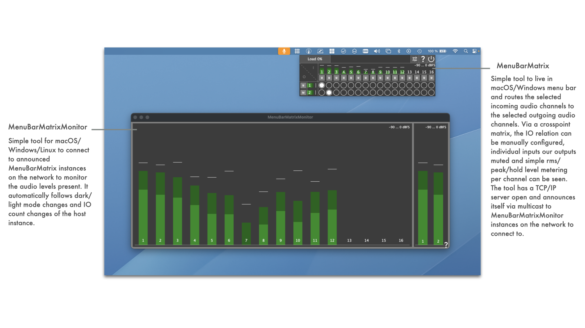
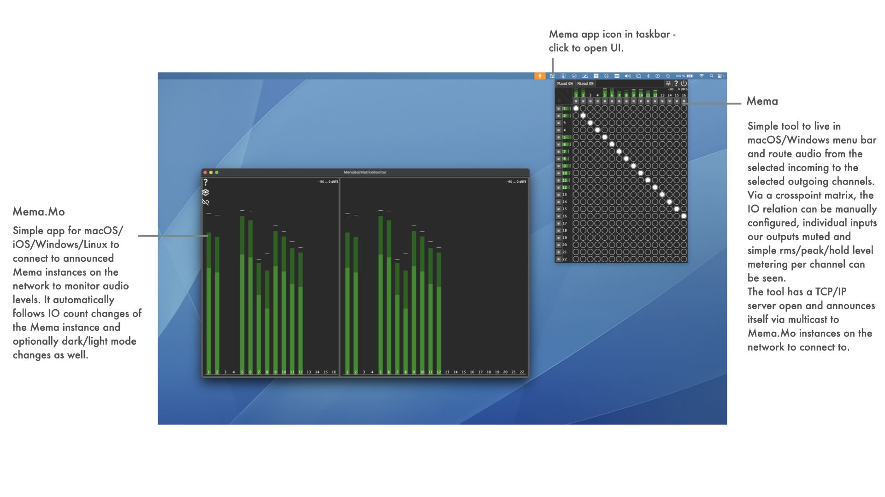

See [LATEST RELEASE](https://github.com/ChristianAhrens/MenuBarMatrix/releases/latest) for available binary packages or join iOS TestFlight Beta:

|Appveyor CI build status|MenuBarMatrix|MenuBarMatrixMonitor|
|:----------------|:-----|:-----|
|macOS Xcode|  |
|Windows Visual Studio|  |
|Linux makefile|  |

<a name="toc" />

## Table of contents

* [Introduction](#introduction)
* [How to build the tools](#howtobuild)
  * [MenuBarMatrix](#buildmenubarmatrix)
  * [MenuBarMatrixMonitor](#buildmenubarmatrixmonitor)
* [Usecase: Studio sidecar monitoring](#rackmonitoringusecase)
* [Usecase: Mobile recording monitoring](#mobilerecordingusecase)
* [App Architecture](#architectureoverview)

<a name="introduction" />

## Introduction

MenuBarMatrix is a programming experiment to try out how a macOS menu bar tool can be made that provides audio matrix routing functionality using JUCE framework - e.g. to route BlackHole 16ch virtual device to system output to overcome AppleMusic behaviour on macOS to only play out higher order surround sound formats when exactly 16 output channels are presented by selected system audio output device.

It is accompanied by a separate tool MenuBarMatrixMonitor to monitor the incoming and outgoing audio via network. It connects to MenuBarMatrix through a TCP connection and supports discovering the available instances through a multicast service announcement done by ManuBarMatrix.

Its sourcecode and prebuilt binaries are made publicly available to enable interested users to experiment, extend and create own adaptations.

Use what is provided here at your own risk!

<a name="howtobuild" />

## How to build the tools

MenuBarMatrix and MenuBarMatrixMonitor are based on JUCE C++ framework, which is a submodule of this repository.

JUCE's Projucer tool can either be used from a local installation or from within the submodule (submodules/JUCE/extras/Projucer).

<a name="buildmenubarmatrix" />

### MenuBarMatrix

[MenuBarMatrix Projucer project](MenuBarMatrix.jucer) file can be found in repository root directory.

In [macOS buildscripts](Resources/Deployment/macOS), shellscripts for automated building of the app, dmg and notarization are kept. These require a properly prepared machine to run on (signing certificates, provisioning profiles, notarization cretentials).

In [iOS buildscripts](Resources/Deployment/iOS), shellscripts for automated building of the app and updloading to the appstore are kept. These require a properly prepared machine to run on (appstore cretentials).

In [Windows buildscripts](Resources/Deployment/Windows), bash scripts for automated building of the app and installer (Innosetup based) are kept. These require a properly prepared machine to run on (innosetup installation).

In [Linux buildscripts](Resources/Deployment/Linux), shell scripts for automated building of the app are kept. These are aimed at building on Debian/Ubuntu/RaspberryPiOS and TRY to collect the required dev packages via apt packetmanager automatically.

<a name="buildmenubarmatrixmonitor" />

### MenuBarMatrixMonitor

[MenuBarMatrixMonitor Projucer project](MenuBarMatrixMonitor/MenuBarMatrixMonitor.jucer) file can be found in /MenuBarMatrixMonitor subdirectory .

In [macOS buildscripts](Resources/Deployment/macOS), shellscripts for automated building of the app, dmg and notarization are kept. These require a properly prepared machine to run on (signing certificates, provisioning profiles, notarization cretentials).

In [iOS buildscripts](Resources/Deployment/iOS), shellscripts for automated building of the app and updloading to the appstore are kept. These require a properly prepared machine to run on (appstore cretentials).

In [Windows buildscripts](Resources/Deployment/Windows), bash scripts for automated building of the app and installer (Innosetup based) are kept. These require a properly prepared machine to run on (innosetup installation).

In [Linux buildscripts](Resources/Deployment/Linux), shell scripts for automated building of the app are kept. These are aimed at building on Debian/Ubuntu/RaspberryPiOS and TRY to collect the required dev packages via apt packetmanager automatically.

<a name="rackmonitoringusecase" />

## Usecase: Studio rack monitoring

* MenuBarMatrix on macOS
  * BlackHole 16ch used to route signal from LogicPro, Apple Music, etc. to MenuBarMatrix
  * Output to Allen&Heath QU-16 22ch audio driver interface
* MenuBarMatrixMonitor on DIY 19" rack display, based on RaspberryPi (32bit RaspberryPiOS, Bullseye)
  * 16 audio input channel metering visible
  * 22 audio output channel metering visible

<a name="mobilerecordingusecase" />

## Usecase: Mobile recording monitoring

* MenuBarMatrix on macOS
  * BlackHole 16ch used to route signal from LogicPro, Apple Music, etc. to MenuBarMatrix
  * Output to stereo audio driver interface
* MenuBarMatrixMonitor on iPadOS in Stagemanager mode
  * 16 audio input channel metering visible
  * 2 audio output channel metering visible

<a name="architectureoverview" />

## App Architecture

_T.B.D._