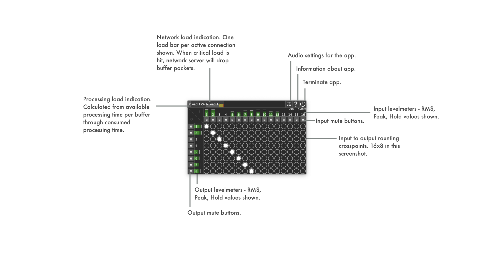
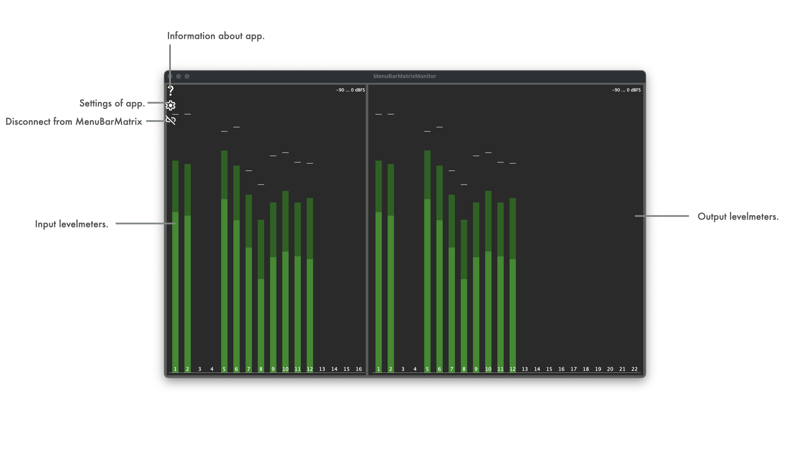
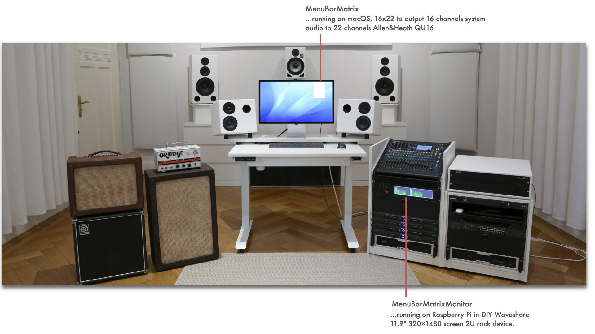
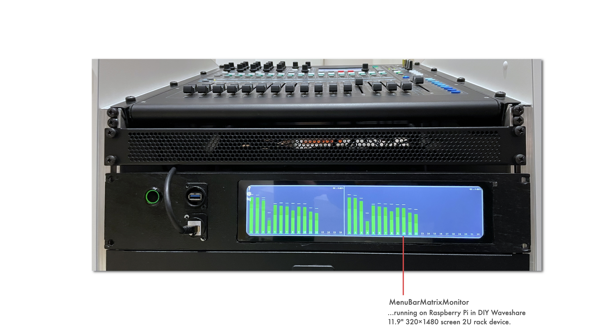
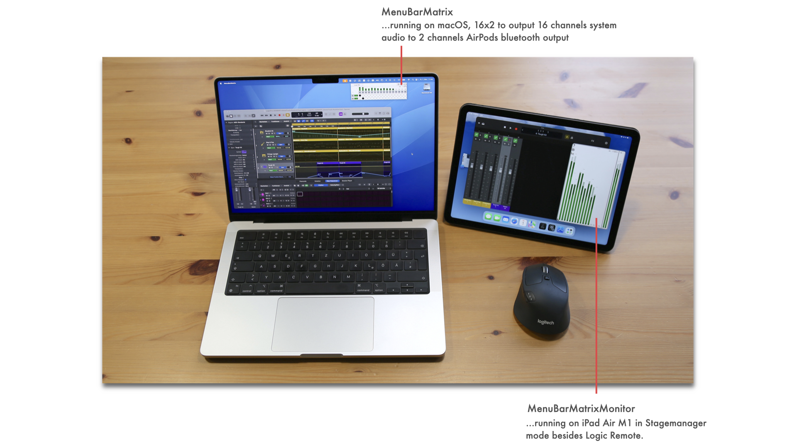

See [LATEST RELEASE](https://github.com/ChristianAhrens/Mema/releases/latest) for available binary packages or join iOS TestFlight Beta:


|Appveyor CI build status|Mema|Mema.Mo|
|:----------------|:-----|:-----|
|macOS Xcode| [](https://ci.appveyor.com/project/ChristianAhrens/Mema-06mmy) | [](https://ci.appveyor.com/project/ChristianAhrens/Mema-ubusx) |
|Windows Visual Studio| [](https://ci.appveyor.com/project/ChristianAhrens/Mema) | [](https://ci.appveyor.com/project/ChristianAhrens/Mema-t97el) |
|Linux makefile| [](https://ci.appveyor.com/project/ChristianAhrens/Mema-y20bx) | [](https://ci.appveyor.com/project/ChristianAhrens/Mema-vhiu1) |


<a name="toc" />

## Table of contents

* [Introduction](#introduction)
  * [Mema and Mema.Mo](#MemaNmonitor)
  * [Mema UI](#MemaUI)
  * [Mema.Mo UI](#MemaMoUI)
* [How to build the tools](#howtobuild)
  * [Mema](#buildMema)
  * [Mema.Mo](#buildMemaMo)
    * [Note on running on RaspberryPiOS Bullseye](#runonbullseye)
* [Usecase: Studio sidecar monitoring](#rackmonitoringusecase)
* [Usecase: Mobile recording monitoring](#mobilerecordingusecase)
* [App Architecture](#architectureoverview)


<a name="introduction" />

## Introduction

Mema is an project initially created to try out if a macOS menubar tool based on JUCE C++ framework can be created, that provides audio matrix routing functionality - e.g. to route [BlackHole](https://github.com/ExistentialAudio/BlackHole) 16ch virtual device to system output to overcome AppleMusic behaviour on macOS to only play out higher order surround sound formats when exactly 16 output channels are presented by selected system audio output device.

It is accompanied by a separate tool Mema.Mo to monitor the audio IO as levelmeters via network. It connects to Mema through a TCP connection and supports discovering the available instances through a multicast service announcement done by ManuBarMatrix.

Its sourcecode and prebuilt binaries are made publicly available to enable interested users to experiment, extend and create own adaptations.

Use what is provided here at your own risk!

<a name="MemaNmonitor" />

### Mema and Mema.Mo


<a name="MemaUI" />

### Mema UI details



<a name="MemaMoUI" />

### Mema.Mo UI details




<a name="howtobuild" />

## How to build the tools

Mema and Mema.Mo are based on JUCE C++ framework, which is a submodule of this repository.

JUCE's Projucer tool can either be used from a local installation or from within the submodule (submodules/JUCE/extras/Projucer).

<a name="buildMema" />

### Mema

[Mema Projucer project](Mema.jucer) file can be found in repository root directory.

In [macOS buildscripts](Resources/Deployment/macOS), shellscripts for automated building of the app, dmg and notarization are kept. These require a properly prepared machine to run on (signing certificates, provisioning profiles, notarization cretentials).

In [iOS buildscripts](Resources/Deployment/iOS), shellscripts for automated building of the app and updloading to the appstore are kept. These require a properly prepared machine to run on (appstore cretentials).

In [Windows buildscripts](Resources/Deployment/Windows), bash scripts for automated building of the app and installer (Innosetup based) are kept. These require a properly prepared machine to run on (innosetup installation).

In [Linux buildscripts](Resources/Deployment/Linux), shell scripts for automated building of the app are kept. These are aimed at building on Debian/Ubuntu/RaspberryPiOS and TRY to collect the required dev packages via apt packetmanager automatically.

<a name="buildMemaMo" />

### Mema.Mo

[Mema.Mo Projucer project](MemaMo/MemaMo.jucer) file can be found in /MemaMo subdirectory .

In [macOS buildscripts](Resources/Deployment/macOS), shellscripts for automated building of the app, dmg and notarization are kept. These require a properly prepared machine to run on (signing certificates, provisioning profiles, notarization cretentials).

In [iOS buildscripts](Resources/Deployment/iOS), shellscripts for automated building of the app and updloading to the appstore are kept. These require a properly prepared machine to run on (appstore cretentials).

In [Windows buildscripts](Resources/Deployment/Windows), bash scripts for automated building of the app and installer (Innosetup based) are kept. These require a properly prepared machine to run on (innosetup installation).

In [Linux buildscripts](Resources/Deployment/Linux), shell scripts for automated building of the app are kept. These are aimed at building on Debian/Ubuntu/RaspberryPiOS and TRY to collect the required dev packages via apt packetmanager automatically.

<a name="runonbullseye" />

#### Building and running Mema.Mo on RaspberryPiOS Bullseye

The build script `build_MemaMo_RaspberryPIOS.sh` in `Resources/Deployment/Linux` can be used on a vanilla installation of RaspberryPi OS to build the tool.

On RaspberriPi 3B it is required to run the build without graphical interface, to avoid the build failing due to going out of memory (e.g. `sudo raspi-config` -> System Options -> Boot -> Console Autologin).

The build result can be run in kind of a kiosk configuration by changing the system to not start the desktop session when running Xserver, but instead run Mema.Mo directly in the X session. To do this, edit or create `.xsession` in user home and simply add a line
```
exec <PATH_TO_REPO>/Mema/MemaMo/Builds/LinuxMakefile/build/MemaMo
```
Then configure the system to auto login to x session (e.g. `sudo raspi-config` -> System Options -> Boot -> Desktop Autologin).

This does only work up to Raspberry Pi OS Bullseye versions, that use X server as window manager. From Bookworm on, Wayland is used that requires differing approaches.

<a name="rackmonitoringusecase" />

## Usecase: Studio rack monitoring





* Mema on macOS
  * BlackHole 16ch used to route signal from LogicPro, Apple Music, etc. to Mema
  * Output to Allen&Heath QU-16 22ch audio driver interface
* Mema.Mo on DIY 19" rack display, based on RaspberryPi (32bit RaspberryPiOS, Bullseye)
  * 16 audio input channel metering visible
  * 22 audio output channel metering visible


<a name="mobilerecordingusecase" />

## Usecase: Mobile recording monitoring



* Mema on macOS
  * BlackHole 16ch used to route signal from LogicPro, Apple Music, etc. to Mema
  * Output to stereo audio driver interface
* Mema.Mo on iPadOS in Stagemanager mode
  * 16 audio input channel metering visible
  * 2 audio output channel metering visible


<a name="architectureoverview" />

## App Architecture

_T.B.D._